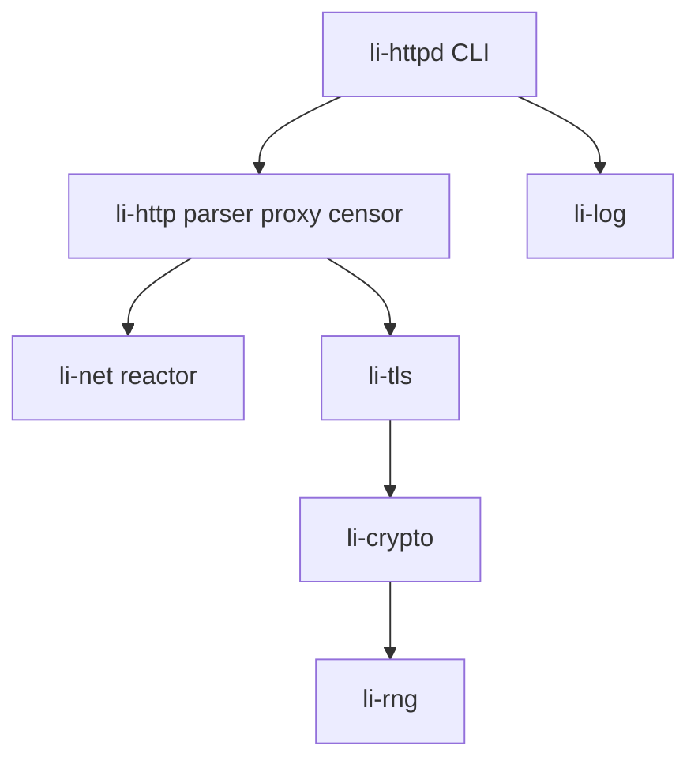

# Architecture

```mermaid
flowchart TB
  httpd[li-httpd CLI]
  http[li-http parser proxy censor]
  net[li-net reactor]
  log[li-log]
  tls[li-tls]
  crypto[li-crypto]
  rng[li-rng]
  httpd --> http
  httpd --> log
  http --> net
  http --> tls
  tls --> crypto
  crypto --> rng
```

## Packages

See [packages/](packages/) for function-level catalogs. Dependencies use `path` in `li.toml` until published separately.
