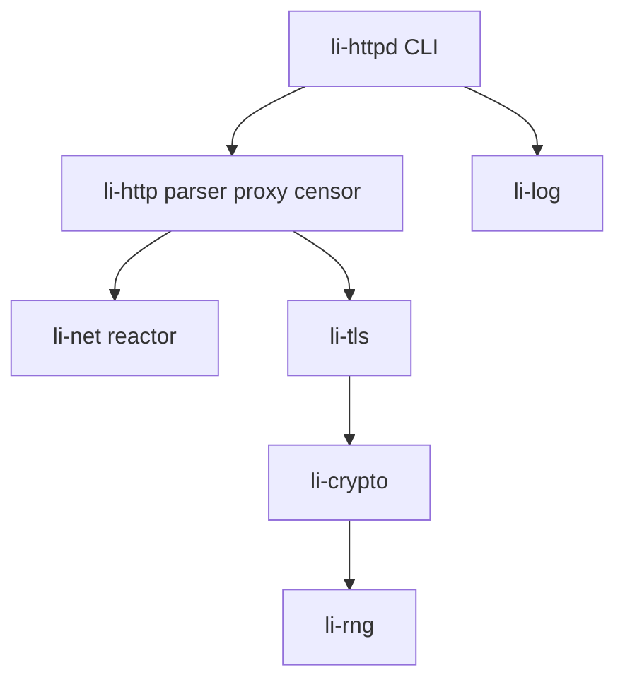
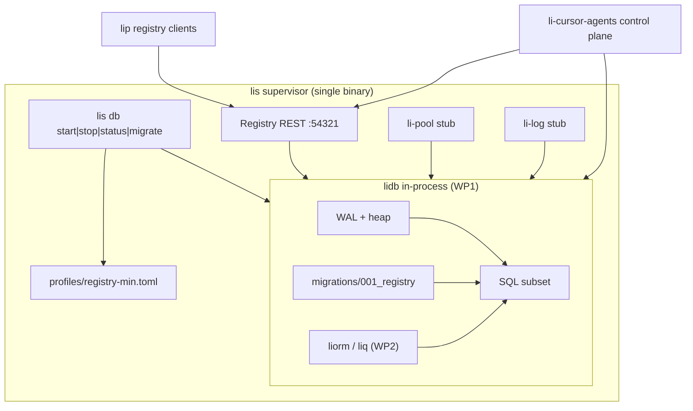

# Architecture

## HTTP gateway (li-httpd)

## Li data platform (PH-DB)

**lis** supervises a lean Supabase-shaped bundle: default profile **`registry-min`**. **lidb** (Postgres-shaped engine) runs **in-process** inside the same `lis` binary — no separate database container.

| Port | Listener | Notes |
|------|----------|-------|
| 54321 | PostgREST-shaped registry API | lip OpenAPI (WP4) |
| 54322 | Postgres wire (lidb) | SQL + migrations |

**Packaging:** Core verticals ship in **lidb + lis**. Optional splits (e.g. `li-auth-oauth`) are documented in [profiles/registry-min.toml](../profiles/registry-min.toml).

**PH-DB-3:** CLI + profile + diagram — `lidb` dependency stubbed until WP1.

**PH-DB-4 (this repo):** `routes/registry/` REST handlers + `openapi/registry-v1.yaml` + mock `liorm` store; real `execute(plan_id)` when WP1–WP2 link.

## Packages

See [packages/](packages/) for function-level catalogs. Dependencies use `path` in `li.toml` until published separately.
