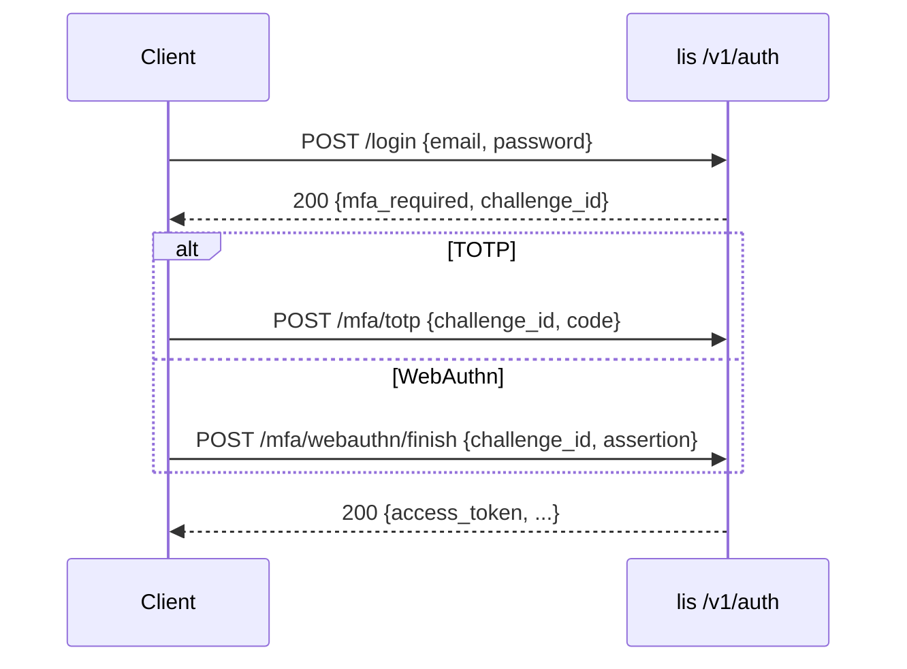

# Auth: MVP and Phase 1 (TOTP + WebAuthn)

Registry-min auth for the Li package platform. **MVP (shipped)** uses email+password sessions and long-lived API tokens. **Phase 1** adds TOTP and WebAuthn as second factors without breaking lip publish flows.

## MVP (current)

| Endpoint | Method | Auth | Purpose |
|----------|--------|------|---------|
| `/v1/auth/signup` | POST | — | Register user + publisher |
| `/v1/auth/login` | POST | — | Email/password → session JWT |
| `/v1/auth/tokens` | POST | Session bearer | Mint API token (`lip_…`) |
| `/v1/auth/tokens` | GET | Session bearer | List active tokens |
| `/v1/auth/tokens/{id}` | DELETE | Session bearer | Revoke token |

### Session JWT

- Algorithm: **HS256** with `LI_JWT_SECRET`
- Claims: `sub` (user UUID), `role=authenticated`, `publisher_id`, `typ=session`, `exp`, `iat`
- TTL: 1 hour (MVP)

### API tokens (lidb `004_auth_tokens`)

Stored fields align with `api_tokens` migration:

| Column | MVP mock | Notes |
|--------|----------|-------|
| `token_hash` | SHA-256 of plain token | Plain token returned once at create |
| `publisher_id` | User's publisher | FK to `publishers` when lidb linked |
| `scope` | `publish`, `yank`, `publish+yank` | Enforced on registry publish/yank |
| `expires_at` | Optional | Omitted = no expiry |

### Dev bypass

`LI_REGISTRY_DEV_TOKEN` accepts a fixed bearer for local publish/yank without signup. **Never set in production.**

### Client storage

`lip/scripts/lip-login.sh` writes `~/.config/lip/credentials.toml`:

```toml
[registry]
url = "http://127.0.0.1:54321/v1"
token = "lip_…"
email = "you@example.com"
```

## Phase 1 — TOTP + WebAuthn (spec)

Goal: password + second factor for session login; API tokens remain for CI/publish (optionally restricted).

### User model extensions (future migration)

```sql
CREATE TABLE users (
    id              UUID PRIMARY KEY DEFAULT gen_random_uuid(),
    email           TEXT NOT NULL UNIQUE,
    password_hash   TEXT NOT NULL,
    totp_secret     BYTEA,              -- encrypted at rest
    totp_enabled    BOOLEAN NOT NULL DEFAULT false,
    created_at      TIMESTAMPTZ NOT NULL DEFAULT now()
);

CREATE TABLE webauthn_credentials (
    id              UUID PRIMARY KEY DEFAULT gen_random_uuid(),
    user_id         UUID NOT NULL REFERENCES users(id) ON DELETE CASCADE,
    credential_id   BYTEA NOT NULL UNIQUE,
    public_key      BYTEA NOT NULL,
    sign_count      BIGINT NOT NULL DEFAULT 0,
    transports      TEXT[],
    label           TEXT,
    created_at      TIMESTAMPTZ NOT NULL DEFAULT now()
);
```

### Login flow (Phase 1)



### New endpoints (Phase 1)

| Endpoint | Method | Purpose |
|----------|--------|---------|
| `/v1/auth/mfa/totp/enroll` | POST | Session → QR secret + backup codes |
| `/v1/auth/mfa/totp/verify` | POST | Complete login challenge |
| `/v1/auth/mfa/webauthn/register/options` | POST | Registration ceremony options |
| `/v1/auth/mfa/webauthn/register/finish` | POST | Store credential |
| `/v1/auth/mfa/webauthn/login/options` | POST | Assertion challenge |
| `/v1/auth/mfa/webauthn/login/finish` | POST | Complete login challenge |

### Security requirements

1. **TOTP**: RFC 6238, 30s step, ±1 window; secrets encrypted with `LI_JWT_SECRET` derived key.
2. **WebAuthn**: FIDO2 / CTAP2; require `userVerification=preferred`; attestation `none` for MVP Phase 1.
3. **Challenges**: Single-use, 5-minute TTL, bound to `challenge_id` + client IP hash.
4. **API tokens**: Unaffected by MFA for publish automation; optional policy `require_mfa_for_token_create` later.
5. **Recovery**: Backup codes (one-time, hashed); admin revoke via service role.

### lip-login.sh (Phase 1)

- Browser path: open `/v1/auth/device` (future) or local callback URL for WebAuthn.
- Device code: `POST /v1/auth/device` → poll `POST /v1/auth/device/token` (OAuth2 device flow shape).
- TTY path: password + TOTP prompt when `mfa_required`.

## Environment

| Variable | Required | Description |
|----------|----------|-------------|
| `LI_JWT_SECRET` | Yes (auth routes) | HS256 signing key for session JWTs |
| `LI_REGISTRY_DEV_TOKEN` | No | Dev-only publish bearer bypass |
| `LI_DATA_DIR` | Yes | Persists `auth-mock.json` + registry data |

See [routes/auth/README.md](../routes/auth/README.md) for run and test commands.
