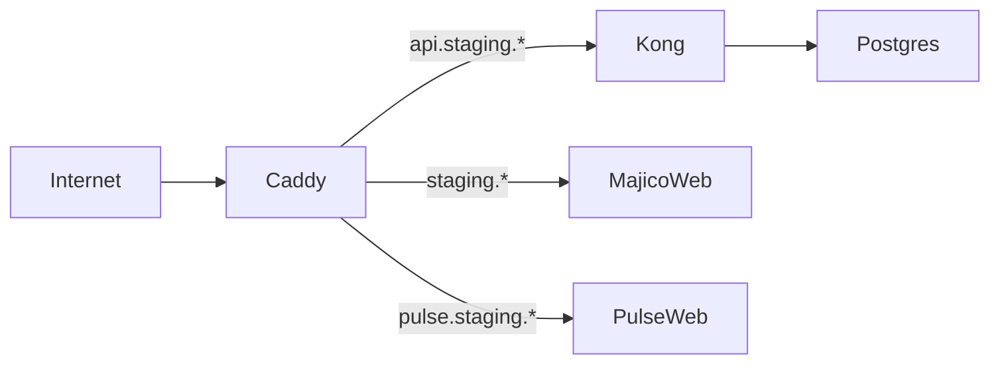

# Majico staging (containers + lis edge)

Self-hosted staging on a VPS (e.g. IONOS) without Supabase Cloud free tier: run **app containers** on Docker, **Postgres/Auth/REST** via optional Supabase compose overlay, and terminate TLS at the edge using **li-httpd TOML** rendered to **Caddy** until `li-httpd` M1 ships.

## Architecture



| Layer | Component | Status |
|-------|-----------|--------|
| Edge | `profiles/httpd/majico-staging.toml` → Caddy | **Bridge** (validated TOML) |
| Edge (target) | `li-httpd` binary | Planned M1 in **lic** |
| Data | `docker-compose.supabase.yml` | Optional; replace Kong stub with official Supabase docker init |
| Apps | `MAJICO_WEB_IMAGE`, `PULSE_WEB_IMAGE` | Your CI-built images |

## Install lis (operator)

### From git (development)

```bash
git clone https://github.com/li-langverse/lis.git
cd lis
./scripts/install-lis.sh
export PATH="$HOME/.local/bin:$PATH"
lis http validate profiles/httpd/majico-staging.toml
```

### Via lip (path or git)

```bash
git clone https://github.com/li-langverse/lip.git
cd lip/packages/lis-cli
lip install   # vendors lis repo when path/git dep configured
```

See [packages/lis-cli/README.md](../packages/lis-cli/README.md).

## Bootstrap staging host

1. DNS: `staging.*`, `api.staging.*`, `pulse.staging.*` → VPS public IP.
2. Install Docker + docker compose plugin.
3. Copy `deploy/staging/.env.example` → `deploy/staging/.env` and set hosts, image tags, Supabase keys.
4. Edit `profiles/httpd/majico-staging.toml` `[[site]].host` values to match `.env` hostnames.
5. Start stack:

```bash
export LI_HTTPD_PROFILE="$PWD/profiles/httpd/majico-staging.toml"
lis staging up --with-supabase   # adds Kong + Postgres overlay
```

6. Point Majico `NEXT_PUBLIC_SUPABASE_URL` at `https://<api-host>` (same as `.env`).

## Verify

```bash
lis http render-caddy profiles/httpd/majico-staging.toml -o /tmp/Caddyfile
curl -fsS "http://127.0.0.1/health" -H "Host: staging.majico.example"   # after DNS + ACME
```

Run Majico repo checks against staging DB:

```bash
cd majico.xyz
npm run verify:api-db-local   # with .env targeting staging API URL + keys
```

## Not in scope (this slice)

- Full Supabase Studio, Storage, Edge Functions — add from upstream Supabase docker when needed
- **lis** `registry-min` as production Supabase replacement — separate PH-DB track ([production-registry.md](production-registry.md))
- Replacing Caddy with `li-httpd` — flip edge when `lic/build/li-httpd` is available on the host

## Related

- [production-registry.md](production-registry.md) — registry-min + li-httpd TLS target
- [docs/packages/li-httpd.md](packages/li-httpd.md) — planned gateway binary
